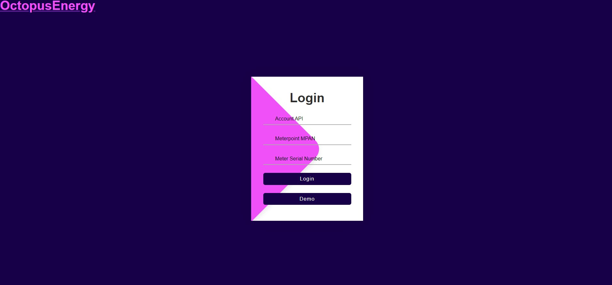

# OctoCare-Agile-Electricity
 * This file serves as the main documentation for the OctoCare-Agile-Electricity project.
 * It provides an overview of the project, its purpose, and instructions on how to use it.
 * Author: Rodwell
 * Version: 2.0
 * Date: 12/01/2024

## Overview

This project is a simple app that allows users to see their future electricity prices one day in advance and to see their current daily and month's electricity usage cost. It uses the Octopus Energy API to collect users meter data displays such information

## Installation

To install the dependencies for this project, follow these steps:

1. Clone the project repository from GitHub.
2. Navigate to the project directory:
3. Install the required dependencies by running the following command:

  ```shell
  npm install
```

4. Start FrontEnd server from terminal; navigating to the src directory:
  OctoCare-Agile-Electricity\client\src run the following command:

 ```shell
    npm start
```
5. if browser does not open automatically then Open your web browser and navigate
to `http://localhost:3000` to access the OctoCare-Agile-Electricity application.

##### if you do not have an API key from Octopus Energy then click on the demo button for a preveiw of the application without starting backend server


6. Start Backend server from terminal; navigate to the server directory:
OctoCare-Agile-Electricity\server and run following command:
 ```shell
   node start index.js
```
  ## Usage

  Once the project is up and running, you can use the OctoCare-Agile-Electricity application to manage your electricity solutions in an agile manner. Follow the instructions provided in the application to perform various tasks. If you do not own an API Key from Octopus Energy then click on the demo for a view of the application

  ## Contributing

  If you would like to contribute to the OctoCare-Agile-Electricity project, please follow these guidelines:

  1. Fork the repository on GitHub.
  2. Create a new branch with a descriptive name.
  3. Make your changes and commit them to your branch.
  4. Push your branch to your forked repository.
  5. Submit a pull request to the main repository.
